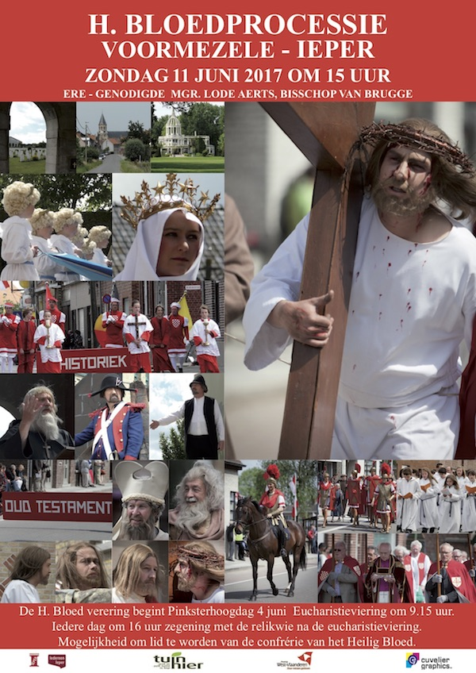
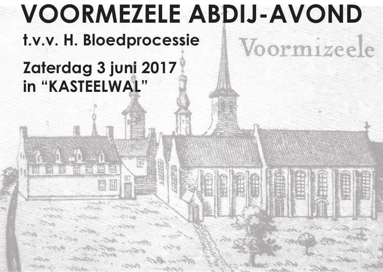
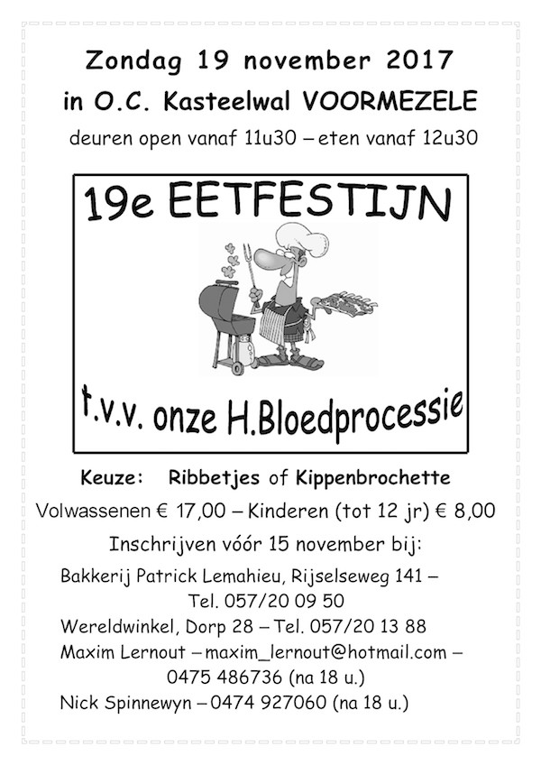

## Verering H. Bloed
De H. Bloed verering begint Pinksterhoogdag, 4 juni met een eucharistieviering om 9.15 uur.
Iedere dag om 16 uur is er zegening met de relikwie na de eucharistieviering.

## H. Bloedprocessie 2017

De H. Bloedprocessie gaat door op zondag 11 juni 2018 om 15 uur.

Ere-genodigde Mgr Lode Aerts, bisschop van Brugge.
 

    

## Abdij-avond

Op zaterdag 3 juni gaat de abdij-avond t.v.v. de H. Bloedprocessie door in O.C. Kasteelwal.
Degustatie vanaf 19u; abdijkazen, abdijbier, abdijbrood.

Inschrijven voor 31 mei 2017.

    

## Eetfestijn

Op zondag 19 november 2017 gaat in O.C. Kasteelwal het 19de eetfestijn t.v.v de H. Bloedprocessie door.

Deuren open vanaf 11u30, eten vanaf 12u30. Inschrijven voor 15 november.

    

