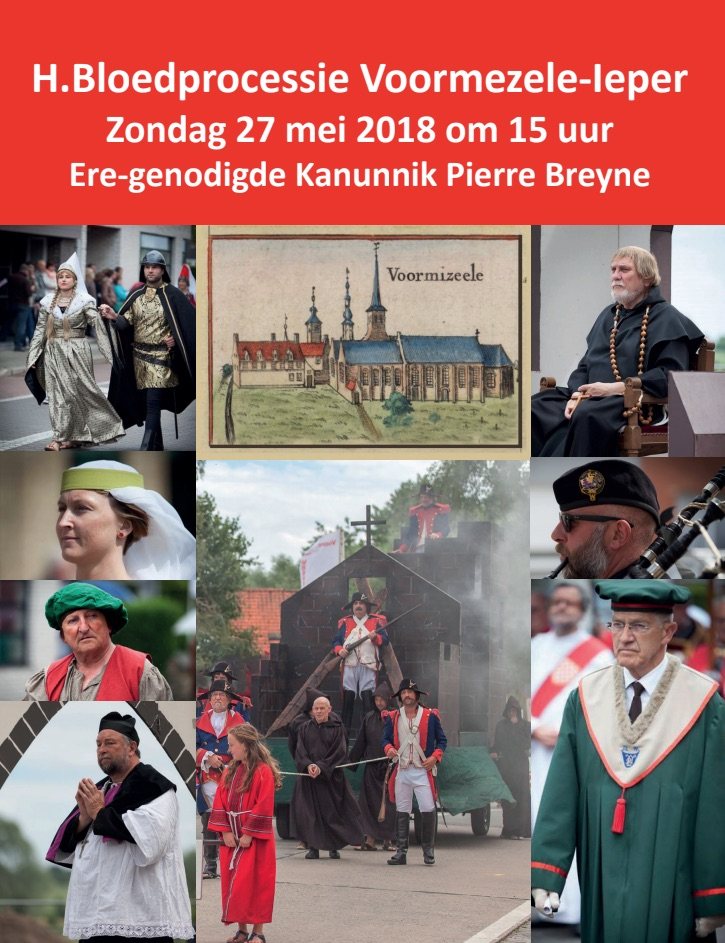
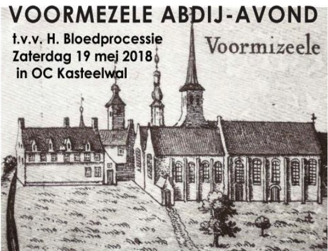

## Verering H. Bloed

De achtdaagse verering van het H. Bloed start op Pinksterzondag 20 mei met een eucharistieviering om 9.15 uur.
Iedere dag om 16 uur zegening met de relikwie na de eucharistieviering.

Na de H. Bloedprocessie is er plechtige bedevaartsmis opgeluisterd door het Koninklijk
Sint-Catharinakoor uit Zillebeke.

## H. Bloedprocessie 2018

De H. Bloedprocessie gaat door op zondag 27 mei 2018 om 15 uur.

Ere-genodigde Kanunnik Pierre Breyne.
 

    

## Abdij-avond

Op zaterdag 19 mei gaat de abdij-avond t.v.v. de H. Bloedprocessie door in O.C. Kasteelwal.
Degustatie vanaf 19u; abdijkazen, abdijbier, abdijbrood.

Inschrijven voor 15 mei 2018.

    

